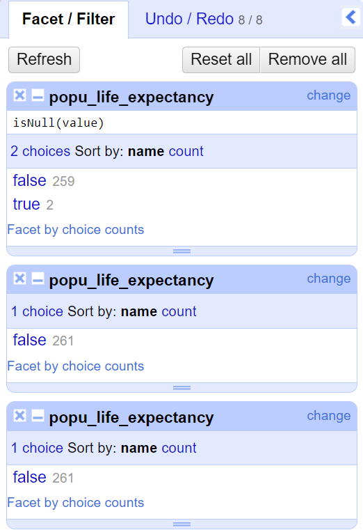
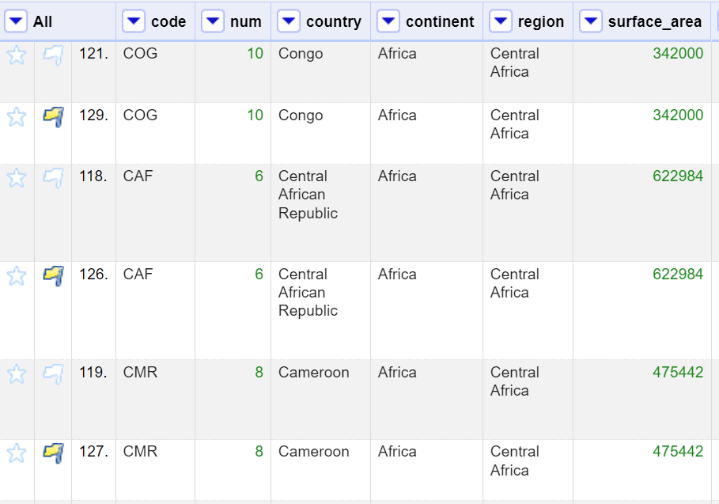

# Análisis Exploratorio de Datos (ADE) con OpenRefine

## Acerca de la guía
Este proyecto es una práctica basada en el uso de OpenRefine para la limpieza de datos. La actividad se realizó con el objetivo de aprender y aplicar conceptos de alfabetización de datos y manejo de herramientas para la preparación y limpieza de datasets.

Fuente: Curso "Alfabetización de datos - Tema 4: Limpieza de datos con OpenRefine".
Autor: Danny Murillo González. 
Entidad: Centro de Investigación, Desarrollo e Innovación en Tecnologías de la Información y las Comunicaciones (CIDITIC).

Puedes acceder al material original a través del repositorio oficial en el siguiente enlace: [Repositorio RIDDA2 UTP](https://ridda2.utp.ac.pa/bitstream/handle/123456789/18247/practica-open-refine-v2-2024-02-06.pdf?sequence=14&isAllowed=y)

## Objetivo 

Adquirir competencias en el manejo de datos, incluyendo su normalización, manipulación y limpieza, para realizar de manera óptima el análisis exploratorio de datos (AED) y posteriormente exponer los resultados mediante visualizaciones claras y dinámicas.

## Descripción

Los datos que se van a analizar representan información relacionada con países o regiones del mundo. Cada fila parece representar un país o territorio, y las columnas contienen varios datos sobre cada uno. A continuación se explican las columnas que contiene el conjunto de datos.

- `code`: código alfabético del país o región.
- `num`: código numérico del país o región.
- `country`: el nombre del país o territorio.
- `continent`: continente al que pertenece.
- `region`: región a nivel mundial a la que pertenece.
- `surface_area`: área de la superficie del país.
- `independence_year`: año de independencia del país (si es aplicable).
- `population`: población total del país.
- `life_expectancy`: esperanza de vida promedio.
- `pop_life`:  variante de población relacionada con la esperanza de vida.
- `gnp`: Producto Nacional Bruto (PNB).
- `gnp_old`:  versión anterior del PNB.
- `local_name`: nombre local del país en su idioma.
- `government_form`: forma de gobierno del país (por ejemplo, monarquía constitucional).
- `street`: direcciones específicas.
- `head_of_state`: nombre del jefe de estado del país.
- `capital`: código numérico de la capital del país.
- `code2`: otro código numérico del país.
- `ganancias`:  ingresos o ganancias del país en alguna unidad monetaria.
- `dominio`: dominio de internet asociado con el país o región.

## Contenido

[1. Open Refine](#1-open-refine)

[2. Creación del proyecto](#2-creación-del-proyecto)

[3. Conceptos importantes](#3-conceptos-importantes)

[3.1. GREL (Google Refine Expression Language)](#31-grel-google-refine-expression-language)

[3.2. Rows vs. records](#32-rows-vs-records)

[3.3. Tipo de datos](#33-tipo-de-datos)

[3.4. Facets](#34-facets)

[4. Análisis Exploratorio de Datos (ADE)](#4-análisis-exploratorio-de-datos-ade)

[4.1. Nombre de las columnas](#41-nombre-de-las-columnas)

[4.2. Gestión de celdas vacías y nulos](#42-gestión-de-celdas-vacías-y-nulos)

[4.3. Gestión por columnas](#43-gestión-por-columnas)

[4.4. Gestión de duplicados](#44-gestión-de-duplicados)

[5. Webgrafía](#5-webgrafía)

[6. Autora](#6-autora)

### 1. Open Refine

OpenRefine es una herramienta gratuita y de código abierto utilizada para gestionar datos desorganizados. Permite limpiarlos, convertirlos entre diferentes formatos y enriquecerlos con servicios web y datos externos. Puedes [descargar OpenRefine](https://openrefine.org/download) desde la página oficial. Una vez descargado solo necesitas descomprimir y abrir desde el icono que encontrarás en la carpeta con la extensión .exe.

<figure>
  
  <figcaption style="font-size: 0.8em; text-align: center; color: #555;">Figura: Icono openrefine.exe.</figcaption>
</figure>

Al hacer clic se abriá el porgrama en el navegador de tu equipo
[↑ Subir](#contenido)

### 2. Creación del proyecto

En la pantalla principal de OpenRefine, haz clic en `Create Project`  y selecciona el archivo con la fuente de datos. Después de seleccionar el archivo, OpenRefine te mostrará una vista previa de los datos. Aquí puedes ajustar la configuración de importación, como el delimitador para archivos CSV, el formato de las fechas, la codificación de caracteres, etc. Revisa los datos y realiza ajustes si es necesario. Asegúrate de que OpenRefine haya detectado correctamente el formato y el contenido del archivo. Por último haz clic en `Create Project` en la parte inferior y OpenRefine cargará los datos y creará un nuevo proyecto con ellos.

<figure>
  
  <figcaption style="font-size: 0.8em; text-align: center; color: #555;">Figura: Create Project.</figcaption>
</figure>

Una vez cargados podrás cargarlos siempre desde 

<figure>
  
  <figcaption style="font-size: 0.8em; text-align: center; color: #555;">Figura: Open Projects.</figcaption>
</figure>

[↑ Subir](#contenido)

### 3. Conceptos importantes

#### 3.1. GREL (Google Refine Expression Language)

[↑ Subir](#contenido)

#### 3.2. Rows vs. records

Rows vs. records
A row is a simple way to organize data: a series of cells, one cell per column. Sometimes there are multiple pieces of information in one cell, such as when a survey respondent can select more than one response.

In cases where there is more than one value for a single column in one or more rows, you may wish to use OpenRefine’s records mode: this defines a single record as potentially containing more than one row. From there you can transform cells into multiple rows, each cell containing one value you’d like to work with.

Generally, when you import some data, OpenRefine reads that data in row mode. From the project screen, you can convert the project into records mode. OpenRefine remembers this action and will present you with records mode each time you open the project from then on.

OpenRefine understands records based on the content of the first column, what we call the “key column.” Splitting a row into a multi-row record will base all association on the first column in your dataset.

If you have more than one column to split out into multiple rows, OpenRefine will keep your data associated with its original record, and associate subgroups based on the top-most row in each group.

You can imagine the structure as a tree with many branches, all leading back to the same trunk.

For example, your key column may be a film or television show, with multiple cast members identified by name, associated to that work. You may have one or more roles listed for each person. The roles are linked to the actors, which are linked to the title.

Once you are in records mode, you can still move some columns around, but if you move a column to the beginning, you may find your data becomes misaligned. The new key column will sort into records based on empty cells, and values in the old key column will be assigned to the last row in the old record (the key value sitting above those values).

OpenRefine assigns a unique key behind the scenes, so your records don’t need a unique identifier in the key column. You can keep track of which rows are assigned to each record by the record number that appears under the All column.

To split multi-valued cells and apply other operations that take advantage of records mode, see Transforming data.

Be careful when in records mode that you do not accidentally delete rows based on being blank in one column where there is a value in another.

This feature is related to Column Groups, which however is incomplete and deprecated.

[↑ Subir](#contenido)

### 3.3. Tipo de datos

Según la documentación oficial los [tipos de datos](https://openrefine.org/docs/manual/exploring) que existen son:

- _string_: uno o más caracteres de texto.
- _number_: uno o más caracteres numéricos.
- _boolean_: cuyos valores son _true_ o _false_.
- _date_: formato extendido compatible con ISO-8601 con tiempo en UTC: YYYY-MM-DDTHH:MM
- _error_: se crea cuando la celda almacena un error generado durante una transformación en OpenRefine.
- _null_: en casos de celdas sin valor. No confundir con celdas que contienen valores como '0', 'false', espacios en blanco o cadenas vacías, etc.

Para comprobar el tipo de dato en caso de una celda, se puede usar `type(value)`. 

- Selecciona la columna en la que quieres aplicar la expresión. Haz clic en el menú desplegable de la columna.
- Ve a _Edit cells_ → _Transform..._.

<figure>
  
  <figcaption class="styled-figcaption">Figura 1: Uso de type(value) en OpenRefine.</figcaption>
</figure>

- En el cuadro de diálogo que aparece, en el campo de expresión, escribe: `type(value)`. Esto devolverá el tipo de dato de cada celda.

<figure>
  
  <figcaption class="styled-figcaption">Figura 1: Uso de type(value) en OpenRefine.</figcaption>
</figure>

[↑ Subir](#contenido)

### 3.4. Facets

[↑ Subir](#contenido)

### 4. Análisis Exploratorio de Datos (ADE)

### 4.1. Nombre de las columnas

En primer se normalizarán los nombres de las columnas. Para ello se debe seleccionar la columna donde se desea eralizar el cambio, después `Edit Column` -> `Rename this column`. 

<figure>
  
  <figcaption class="styled-figcaption">Figura 1: Uso de type(value) en OpenRefine.</figcaption>
</figure>

Se introduce el nuevo nombre y se pulsa `Ok`.

<figure>
  
  <figcaption class="styled-figcaption">Figura 1: Uso de type(value) en OpenRefine.</figcaption>
</figure>

Los cambios que se han realizado son:

1. Traducción español a inglés

| **Nombre original** | **Nombre modificado** |
|---------------------|------------------------|
| `ganancias`         | `earnings`             |
| `dominio`           | `domain`               |

2. Conversión a _lower case_

| **Nombre original** | **Nombre modificado** |
|---------------------|------------------------|
| `Num`               | `num`                  |

3. Modificación de nombres confusos o imprecisos

| **Nombre original**  | **Nombre modificado**      |
|----------------------|----------------------------|
| `life_expectancy`    | `life_expectancy_avg`      |
| `pop_life`           | `popu_life_expectancy`     |
| `Street`            | `address`              |

[↑ Subir](#contenido)

### 4.2. Gestión de celdas vacías y nulos

Para este ejemplo escogeremos la columna `popu_life_expectancy`. Sigue los siguientes pasos:

1. Selecciona la columna: Asegúrate de tener la columna sobre la cual quieres aplicar la faceta seleccionada.

2. Para celdas nulas:

> _Facet -> Customized facets -> Facet by null_

Esto te permitirá crear una faceta que agrupa las celdas que son nulas (es decir, celdas que no tienen ningún valor asignado).

3. Para celdas vacías:

> _Facet -> Customized facets -> Facet by empty string_

Esto creará una faceta que agrupa las celdas que contienen una cadena vacía ("").

4. Para celdas en blanco:

> _Facet -> Customized facets -> Facet by blank_

Esta opción agrupa tanto celdas que son nulas, celdas vacías (""), como celdas que contienen solo espacios en blanco (" ").

<figure>
  
  <figcaption class="styled-figcaption">Figura: Selección facet by null.</figcaption>
</figure>

Si realizas los tres casos anteriores debe aparecerte algo como esto:

<figure>
  
  <figcaption class="styled-figcaption">Figura: Facets de nulos y celdas vacías.</figcaption>
</figure>

En cada _facet_ puedes pulksar en el botón _change_ para ver la consulta realizada y los resultados.

A continuación expondremos los cambios que se realizarán en este caso, columna por columna.

**Columna _continent_**
- Nulos: 253
- Datos: 8

Existe otra columna que contiene el nombre del país o región y no tiene datos vacíos, por lo que con su ayuda podremos completar el continente correspondiente. Veamos cuántos países diferentes existen. Selecciona:

> _Facet -> Text facet_

En el panel de facets que aparece, verás todos los nombres de países únicos, junto con un conteo de cuántas veces aparece cada uno. Hay muchos países como para hacerlo a mano uno por uno.

<figure>
  
  <figcaption class="styled-figcaption">Figura: Facets de conteos de países.</figcaption>
</figure>

Para esta transformación vamos a realizar los siguientes pasos.

1. Buscamos un dataset que contenga dos columnas: una con nombre de países y la segunda columna con el nombre del contienente correspondiente. Intentaremos que el dataset esté en formato .xlsx para evitar problemas de interpretación de los datos. Crearemos un nuevo proyecto.

<figure>
  
  <figcaption class="styled-figcaption">Figura: countries-continents-project.</figcaption>
</figure>

2. Detrectamos que en la columna _country_ del dataset original, existen algunos nombre que no comienzan por mayúscula, por lo que estandarizamos.

> _Country -> Edit cell -> Transform..._

Escribimos la siguiente expresión: `value.toTitlecase()`

<figure>
  
  <figcaption style="font-size: 0.8em; text-align: center; color: #555;">Figura: value-to-titlecase.</figcaption>
</figure>

3. Lo mprimero que haremos será eliminar la columna _continent_ ya que generaremos una nueva columna y usaremos ese mismo nombre. Selecconamos la columna _country_ del dataset.

> _country -> Edit column -> Add column based on this column…_

Añadiremos la siguiente expresión la cual busca el valor de la columna _Country_ en el dataset de referencia "countries_continents_dataset", obtiene el valor correspondiente de la columna Continent, y devuelve ese valor para completar la celda actual. El [0] accede al primer valor en caso de que la búsqueda devuelva una lista.  De esta forma se crea una nueva columna _continent_ con los nombres correspondientes. Algunos valores seguirán en blanco, ya que puede que no existan esas coincidencias. Habrá que escribirlas a mano.

> `cell.cross("countries_continents_dataset", "Country").cells["Continent"].value[0]`

[↑ Subir](#contenido)

### 4.3. Gestión por columnas

**Columna _code_**

Esta columna parece mostrar una codificación del país representada por tres caracteres. No hay nulos o vacíos pero sí que se ha detectado que no todos los valores siguen el formato _uppercase_ por que lo que vamos a transformarlos. Seleccionamos la columna y :

> _Edit cells -> Common transforms -> To uppercase_ 

Así conseguiremos unificar los datos de la columna.

Columnas similares: `capital`.

**Columna _region_**

En esta columna se ha detectado que no todos los valores siguen el formato _titlecase_ por que lo que vamos a transformarlos. Seleccionamos la columna y :

> _Edit cells -> Common transforms -> To titlecase_ 

Así conseguiremos unificar los datos de la columna.

Columnas similares: `local_name`, `address`, `head_of_state`

**Columna _independence year_**

En esta caso se detecta mucha disparidad de datos. Aunque aparentemente son años son tipo _string_. Además, la mayoría son 4 dígitos que parecen representar años, pero también encontramos cifras dígitos en negativo, _nulls_, y 0. Para solucionar esto, vamos a transformar a 0 todos los valores que no tengan una estructura de año y posteriormente convertiremos la columna entera a tipo _number_. Para ellos usaremos `expresiones regulares`. Seleccionamos la columna correspondiente y aplicamos:

> _Edit cells -> Transform..._

En `Expression` incluimos las siguiente expresiones:

1. `value.replace(/^-.*$/, "0")`- Convierte los valores negativos en 0.
2. `value.replace("NuLL", "0")`- Convierte _nulls_ en 0.

Para convertir la columna a _number_

> _Edit cells -> Common transforms -> To number_

<figure>
  
  <figcaption style="font-size: 0.8em; text-align: center; color: #555;">Figura: year-text-to-number.</figcaption>
</figure>

Algo similar haremos con _popu life expectancy_ convirtiendo los nulos a 0 y transformando a _number_. En este caso lo haremos de otra forma. Colocamos el ratón justo encima de una de las celdas con valor "NuLL" y pulsamo en `edit`.

<figure>
  
  <figcaption style="font-size: 0.8em; text-align: center; color: #555;">Figura: edit-a-cell.</figcaption>
</figure>

Escribimos en este caso 0, que es el valor por el que lo queremos sustituir, y posteriormente hacemos clic en `Apply to all identical cells` para que el cambio se aplique a todas las celdas que tienen el mismo valor.

Para convertir la columna a _number_

> _Edit cells -> Common transforms -> To number_

Columnas con cambios similares: `popu_life_expectancy`, `gnp_old`.

**Otras trasnformaciones**

En casos donde desconcemos le dato como en la columna `capital`, hemos rellenado manualmente con N/A.

[↑ Subir](#contenido)

### 4.4. Gestión de duplicados

Para este punto tomaremos como ejemplo la columna `num` ya que esos números, que representan un país, deben ser únicos. Seleccionamos la columna y:

> _Facet -> Customized facets -> Duplicated facet_

<figure>
  
  <figcaption style="font-size: 0.8em; text-align: center; color: #555;">Figura: duplicated-facets.</figcaption>
</figure>

En el panel de la izquierda aparecerán los datos de `num` marcados como TRUE sí el valor de `num` se repite. En este caso son 44 valores repetidos. Si pulsamos en true, nos aparecerá a la derecha solo esos valores. Despúes hacemos clic en `sort...` y después `ok` para que se ordenen por número y poder ver los duplicados en orden.

<figure>
  
  <figcaption style="font-size: 0.8em; text-align: center; color: #555;">Figura: num-sort-duplicates.</figcaption>
</figure>

Para eliminar los duplicados, marcaremos con la bandera aquallas filas que querramos eliminar. 

<figure>
  
  <figcaption style="font-size: 0.8em; text-align: center; color: #555;">Figura: num-flags.</figcaption>
</figure>

Luego desde la columna `All` seleccionaremos solo aquellas que tienen bandera:

> _All -> Transform... -> Facet by flag_

<figure>
  
  <figcaption style="font-size: 0.8em; text-align: center; color: #555;">Figura: facet-by-flag.</figcaption>
</figure>

Ahora el rpograma mostrará las filas que marcadmos anyteriormente con la bandera. Desde esa misma columna eliminaremos esa filas marcadas por la bandera, que son las duplicadas.

> _All -> Edit rows -> Remove matching rows_

<figure>
  
  <figcaption style="font-size: 0.8em; text-align: center; color: #555;">Figura: REMOVE-MATCHING-ROWS.</figcaption>
</figure>

De esta forma podemos eliminar duplicados innecesarios.

[↑ Subir](#contenido)

### 4.5. Agrupación (Cluster) 

En ocasiones podemos encontrar el mismo dato repetido varias veces pero con diferentes formatos. Imagina por ejemplo los datos personales. Imagina por ejmplo un mismo nombre compuesto en diferente formatos: 

- María de los Ángeles
- María de los Angeles
- MARÍA DE LOS ÁNGELES
- María De Los Ángeles
- María delos Ángeles

En este caso, la función `cluster` va a permitir que el porgrama detect estos casos similares, y que nosotros podamos elegir la mejor opción para que todos los registros queden igual.

En este caso lo haremos con la columna `address`. Haremos clic en el botón que aparece en el panel `facet` de la izquierda.

<figure>
  
  <figcaption style="font-size: 0.8em; text-align: center; color: #555;">Figura: facet-cluster.</figcaption>
</figure>

Ahora hacemos clic en el botón que dice `cluster`justo en medio de la pantalla.

<figure>
  
  <figcaption style="font-size: 0.8em; text-align: center; color: #555;">Figura: click-cluster.</figcaption>
</figure>

Esto nos mostrará los casos de agrupación que detecta el programa. A la derecha, en la caja de texto, introducimo el valor que queramos, marcamos `merge` y finalmente pulsamos el botón `Merga selected & re-cluster`.

[↑ Subir](#contenido)

### 4.6. Extraer un _string_ de una columna

Imagina que tenemos una cadena con una estructura similar en una columa. Por ejemplo, la forma de tratamiento más el nombre de una persona:

- Sr. Pedro Jiménez
- Sra. Natalia Sánchez
- D. Aurlio Martínez

Y queremos extraer el tratamiento que en este caso, estaría en primer lugar. Podríamos hacerlo mediante una expresión regular como hemos hecho anteriormente. Sin embargo, en esta ocasión lo haremos de otra forma.

Vamos a obtener una nueva columna a partir de la columna `earnings`, que contendrá solo el valor numérico.  

> _earnings -> Edit columns -> Split into several columns..._

<figure>
  
  <figcaption style="font-size: 0.8em; text-align: center; color: #555;">Figura: split-several-columns.</figcaption>
</figure>

Señalamos la opción `by separator`, en el cuadro de texto debemos dejar un espacio y desmarcamos la opción `remove this column`. Damos a `OK`.

<figure>
  
  <figcaption style="font-size: 0.8em; text-align: center; color: #555;">Figura: split-column-earnings.</figcaption>
</figure>

A continuación vemos como se ha creado una columna por cada una de las cadenas de la columna original. Simeplemente tenemos que mantener la que nos interesa, que en este caso es la que contiene el valor numérico, cambiar el nombre y borrar el resto.

<figure>
  
  <figcaption style="font-size: 0.8em; text-align: center; color: #555;">Figura: earnings-column-splitted.</figcaption>
</figure>

[↑ Subir](#contenido)

### 5. Webgrafía

- [Countries by Continent Dataset](https://www.kaggle.com/datasets/hserdaraltan/countries-by-continent?resource=download)

- [Guide to OpenRefine - University of Louisiana at Lafayette](https://louisiana.libguides.com/guide_to_openrefine)

- [Guía para la limpieza de datos sobre biodiversidad con OpenRefine - Global Biodiversity Information Facility](https://docs.gbif.org/openrefine-guide/3.0/es/)

- [Imagen Portada](https://pixabay.com/es/illustrations/ai-generado-mundo-mapa-datos-8966867/)

- [Limpieza de datos con OpenRefine: Guía práctica - Universidad Tecnológica de Panamá](https://ridda2.utp.ac.pa/handle/123456789/18247)

- [OpenRefine Documentation](https://openrefine.org/docs)

- [OpenRefine Tutorials: How To Join Two Data Set - RefinePro](https://www.youtube.com/watch?v=ogE2xZk7354)

[↑ Subir](#contenido)

### 6. Autora

- [Virginia Ordoño Bernier](https://github.com/viorbe20)