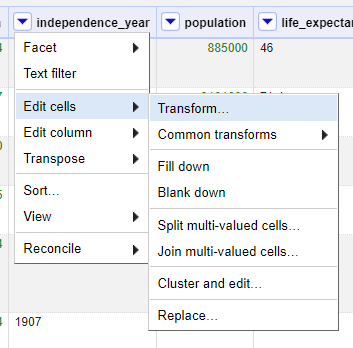
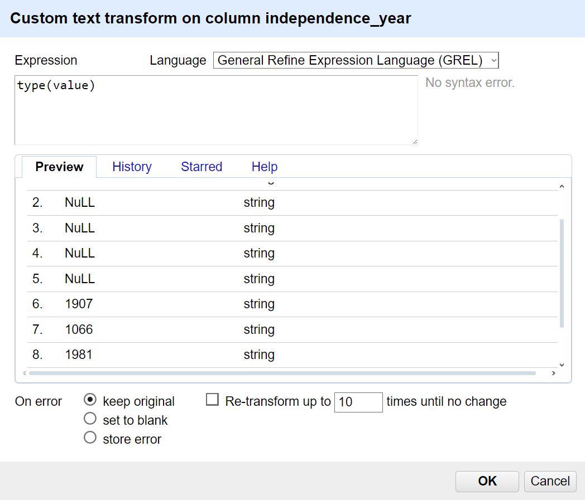

# Análisis Exploratorio de Datos (ADE) con OpenRefine

[Read in English](README.md)

## Acerca de la guía
Este proyecto es una práctica basada en el uso de OpenRefine para la limpieza de datos. La actividad se realizó con el objetivo de aprender y aplicar conceptos de alfabetización de datos y manejo de herramientas para la preparación y limpieza de datasets.

Fuente: Curso "Alfabetización de datos - Tema 4: Limpieza de datos con OpenRefine".
Autor: Danny Murillo González. 
Entidad: Centro de Investigación, Desarrollo e Innovación en Tecnologías de la Información y las Comunicaciones (CIDITIC).

Puedes acceder al material original a través del repositorio oficial en el siguiente enlace: [Repositorio RIDDA2 UTP](https://ridda2.utp.ac.pa/bitstream/handle/123456789/18247/practica-open-refine-v2-2024-02-06.pdf?sequence=14&isAllowed=y)

## Objetivo 

Adquirir competencias en el manejo de datos, incluyendo su normalización, manipulación y limpieza, para realizar de manera óptima el análisis exploratorio de datos (AED) y posteriormente exponer los resultados mediante visualizaciones claras y dinámicas.

## Descripción

Los datos que se van a analizar representan información relacionada con países o regiones del mundo. Cada fila parece representar un país o territorio, y las columnas contienen varios datos sobre cada uno. A continuación se explican las columnas que contiene el conjunto de datos.

- _code_: código alfabético del país o región.
- _num_: código numérico del país o región.
- _country_: el nombre del país o territorio.
_continent_: continente al que pertenece.
_region_: región a nivel mundial a la que pertenece.
_surface_area_: área de la superficie del país.
_ independence_year: año de independencia del país (si es aplicable).
_population_: población total del país.
_life_expectancy_: esperanza de vida promedio.
_pop_life_:  variante de población relacionada con la esperanza de vida.
_gnp_: Producto Nacional Bruto (PNB).
_gnp_old_:  versión anterior del PNB.
_local_name_: nombre local del país en su idioma.
_government_form_: forma de gobierno del país (por ejemplo, monarquía constitucional).
_street_: direcciones específicas.
_head_of_state_: nombre del jefe de estado del país.
_capital_: código numérico de la capital del país.
_code2_: otro código numérico del país.
_ganancias_:  ingresos o ganancias del país en alguna unidad monetaria.
_dominio_: dominio de internet asociado con el país o región.

## Contenido

[1. Open Refine](#1-open-refine)
[2. Carga de datos](#2-carga-datos)
[3. Creación del proyecto](#3-creación-del-proyecto)
[4. Conceptos importantes](#4-conceptos-importantes)
[4.1. Rows vs. records](#41-rows-vs-records)
[4.2. Tipo de datos](#42-tipo-de-datos)
[5. Análisis Exploratorio de Datos (ADE)](#5-análisis-exploratorio-de-datos-ade)

### 1. Open Refine

[↑ Subir](#contenido)

### 2. Carga de datos

[↑ Subir](#contenido)

### 3. Creación del proyecto

[↑ Subir](#contenido)

### 4. Conceptos importantes

#### 4.1. Rows vs. records

Rows vs. records
A row is a simple way to organize data: a series of cells, one cell per column. Sometimes there are multiple pieces of information in one cell, such as when a survey respondent can select more than one response.

In cases where there is more than one value for a single column in one or more rows, you may wish to use OpenRefine’s records mode: this defines a single record as potentially containing more than one row. From there you can transform cells into multiple rows, each cell containing one value you’d like to work with.

Generally, when you import some data, OpenRefine reads that data in row mode. From the project screen, you can convert the project into records mode. OpenRefine remembers this action and will present you with records mode each time you open the project from then on.

OpenRefine understands records based on the content of the first column, what we call the “key column.” Splitting a row into a multi-row record will base all association on the first column in your dataset.

If you have more than one column to split out into multiple rows, OpenRefine will keep your data associated with its original record, and associate subgroups based on the top-most row in each group.

You can imagine the structure as a tree with many branches, all leading back to the same trunk.

For example, your key column may be a film or television show, with multiple cast members identified by name, associated to that work. You may have one or more roles listed for each person. The roles are linked to the actors, which are linked to the title.

Once you are in records mode, you can still move some columns around, but if you move a column to the beginning, you may find your data becomes misaligned. The new key column will sort into records based on empty cells, and values in the old key column will be assigned to the last row in the old record (the key value sitting above those values).

OpenRefine assigns a unique key behind the scenes, so your records don’t need a unique identifier in the key column. You can keep track of which rows are assigned to each record by the record number that appears under the All column.

To split multi-valued cells and apply other operations that take advantage of records mode, see Transforming data.

Be careful when in records mode that you do not accidentally delete rows based on being blank in one column where there is a value in another.

This feature is related to Column Groups, which however is incomplete and deprecated.

[↑ Subir](#contenido)

### 4.2. Tipo de datos

Según la documentación oficial los [tipos de datos](https://openrefine.org/docs/manual/exploring) que existen son:

- _string_: uno o más caracteres de texto.
- _number_: uno o más caracteres numéricos.
- _boolean_: cuyos valores son _true_ o _false_.
- _date_: formato extendido compatible con ISO-8601 con tiempo en UTC: YYYY-MM-DDTHH:MM
- _error_: se crea cuando la celda almacena un error generado durante una transformación en OpenRefine.
- _null_: en casos de celdas sin valor. No confundir con celdas que contienen valores como '0', 'false', espacios en blanco o cadenas vacías, etc.

Para comprobar el tipo de dato en caso de una celda, se puede usar `type(value)`. 

- Selecciona la columna en la que quieres aplicar la expresión. Haz clic en el menú desplegable de la columna.
- Ve a "Edit cells" → "Transform...".

<figure>
  
  <figcaption class="styled-figcaption">Figura 1: Uso de type(value) en OpenRefine.</figcaption>
</figure>

- En el cuadro de diálogo que aparece, en el campo de expresión, escribe: `type(value)`. Esto devolverá el tipo de dato de cada celda.

<figure>
  
  <figcaption class="styled-figcaption">Figura 1: Uso de type(value) en OpenRefine.</figcaption>
</figure>

[↑ Subir](#contenido)

### 5. Análisis Exploratorio de Datos (ADE)

### 5.1. Nombre de las columnas

En primer se normalizarán los nombres de las columnas. Para ello se debe seleccionar la columna donde se desea eralizar el cambio, después `Edit Column` -> `Rename this column`. 

<figure>
  
  <figcaption class="styled-figcaption">Figura 1: Uso de type(value) en OpenRefine.</figcaption>
</figure>

Se introduce el nuevo nombre y se pulsa `Ok`.

<figure>
  
  <figcaption class="styled-figcaption">Figura 1: Uso de type(value) en OpenRefine.</figcaption>
</figure>

Alguna de las acciones que se realizarán son:

a) Traducción a inglés de los nombres de columnas en español.
- `ganancias` | `earnings`
- 'dominio' | 'domain'
b) Conversión a _lower case_
- `Num` | `num`
c) Modificación de nombres que pueden ser confusos o no precisos.
-`Street` | `address`
- `life_expectancy` | `life_expectancy_avg`
- `pop_life` | `popu_life_expectancy`

[↑ Subir](#contenido)

### 4.3. Fechas

